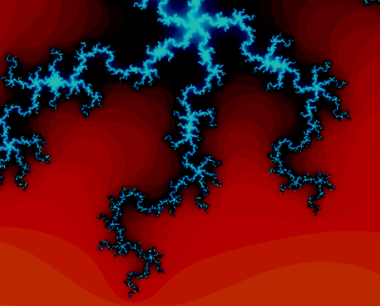

# Interactive Fractal Shader

This project implements a real-time interactive Mandelbrot-like fractal using **GLSL shaders** within the **GLMAN** framework.  
It was developed as the final project for **CS 457: Computer Graphics Shaders** at Oregon State University.

---

## Overview
The shader generates a dynamic fractal pattern that can be explored in real time by adjusting several user-controlled parameters:

| Uniform Variable | Description |
|------------------|-------------|
| `uZoom` | Controls zoom factor for exploring fractal detail |
| `uIntensity` | Adjusts overall brightness |
| `uRedMix`, `uGreenMix`, `uBlueMix` | Blend weights for RGB color channels |
| `uIterationFactor` | Controls iteration depth for detail/performance |
| `uCenterX`, `uCenterY` | Define the fractal’s center point for panning |

The fractal is computed in the **fragment shader** using the escape-time algorithm for the Mandelbrot set.  
The color of each fragment is mapped to the normalized iteration count, producing a vibrant, customizable visual display.

---

## Implementation
- **Language:** GLSL (fragment and vertex shaders)
- **Framework:** GLMAN
- **Files:**
  - `fractal.glib` – Rendering setup and uniform definitions  
  - `fractal.vert` – Vertex shader (passes texture coordinates)  
  - `fractal.frag` – Fragment shader (performs fractal calculations)

---

## Results
The shader renders an interactive fractal pattern that responds to real-time user input:
- Zoom and pan across the fractal
- Adjust brightness and color composition
- Control iteration depth for detail or performance

 *(optional)*

---

## Project Report
See **CS457_Final_Project.pdf** for a detailed write-up and explanation of the implementation.

---

## License
This repository is for educational and portfolio purposes only.  
Feel free to reference or adapt the shaders with credit.
